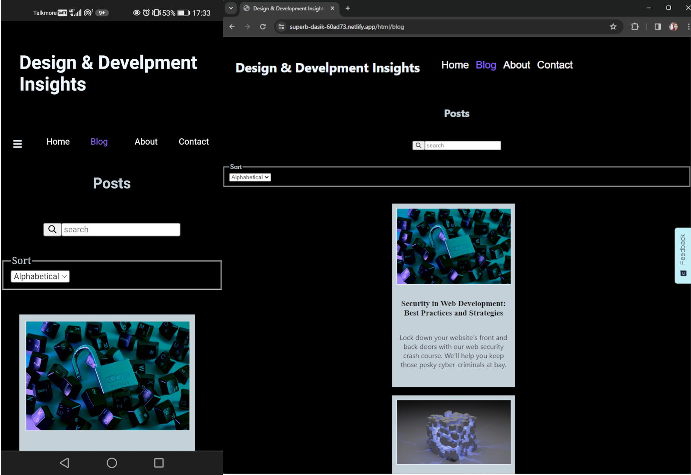

# Design & Development Insights



Through this project, I showcase the ability to fetch blog posts from an API and implement a functional contact form with validation. The website aims to provide insightful articles on various design and development topics while offering users the opportunity to engage through a seamless contact form.

## Description

The Design & Development Insights website is a dynamic blog platform that fetches and displays blog posts from an API source. Users can explore a variety of articles covering the latest trends, best practices, and valuable insights in the fields of design and development. The site also features a contact form with built-in validation, ensuring a smooth and secure interaction for visitors.

## Built With

- [HTML](https://developer.mozilla.org/en-US/docs/Web/HTML)
- [CSS](https://developer.mozilla.org/en-US/docs/Web/CSS)
- [JavaScript](https://developer.mozilla.org/en-US/docs/Web/JavaScript)

## Running

1. Clone the repo:

```bash
git clone https://github.com/Minu321/CA-HTML-CSS.git
```

2. Open index.html in vs code.

3. Run with live server.

## Contribute

If you'd like to contribute, please follow these guidelines:

1. Fork the repository.
2. Create a new branch for your feature: git checkout -b feature-name
3. Make your changes and commit them: git commit -m 'Add new feature'
4. Push to the branch: git push origin feature-name
5. Open a pull request.

## Contact me

- [LinkedIn](https://www.linkedin.com/in/mina-roseth-beni-652b90292/)
